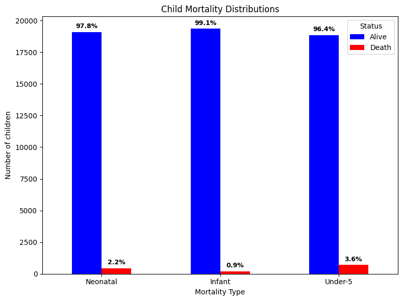
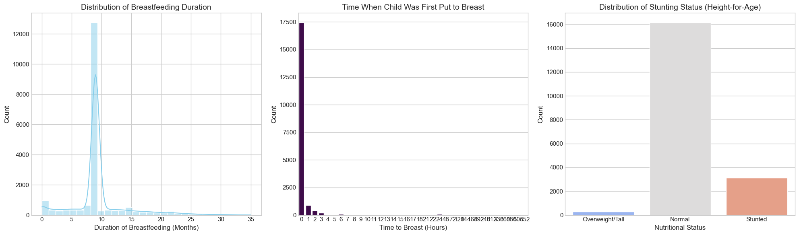

# 
Predictive Modeling of Under-5 Mortality Determinants in Kenya Using KDHS 2022 Data

**Project Overview**

This project focuses on analyzing and predicting under-5 mortality rates using demographic,health and social economic indicators.

The workflow covers data cleaning,exploratory data analysis and modeling  to indentify key factors associated with child mortality and build predictive models.

**Repository structure**

- Data cleaning.ipynb-data processing and feature engineering
-  EDA.ipynb-Exploratory data analysis and visualization
- Modelling.ipynb-Machine learning models and evaluation
- Data
- python-version, Procfile, app.py, model.pkl and requirements.txt files for deployment of the model
- Readme
- Tableau visualization located [here](https://public.tableau.com/app/profile/tingly.amua/viz/Under5Mortality_17594781808960/Story5?publish=yes)

**Business understanding**

*Objectives*:

- Provide actionable insights on high-risk populations  
- Support targeted interventions (e.g., immunization, nutrition, maternal health services)  
- Guide equitable resource allocation  
- Ultimately reduce preventable child deaths  

*stakeholders*:
- policy makers
- Public health agencies
- NGOs and implementing partners
- Academic researchers

**Workflow**

1.Data Cleaning
- Removed missing/inconsistent entries
- Generated cleaned datasets: u5mr_clean.csv, u5mr_subset.csv

2.Exploratory Data Analysis (EDA)
- Distribution plots and trends of under-5 mortality
**Mortality rates**

* **Neonatal mortality** (deaths within the first 28 days of life) shows that **2.2%** of newborns died, while 97.8% survived.
* **Infant mortality** (deaths within the first year of life) shows the lowest mortality rate, at just **0.9%**. This is a curious finding, as infant mortality is typically expected to be higher than neonatal mortality, since it includes neonatal deaths.
* **Under-5 mortality** (deaths before the fifth birthday) has the highest mortality rate at **3.6%**, which is expected as it accounts for deaths over a longer period of time.

- Correlation analysis between indicators:

**Maternal and ANC Factors' Analysis**
a large majority of mothers whose children died had very few or no antenatal visits.
* The highest percentage of deaths (**29.5%**) was among mothers with just **one** antenatal visit.
* The largest percentage of deaths occurred in cases where the first check-up was either never performed (represented by **"0"** at **2.2%** of deaths) or was delayed until the **third month** of pregnancy (**6.8%**).
* This suggests that delayed or absent early antenatal care is strongly linked to child mortality.

**Child Health and Nutrition Factors**

This finding highlights that **access and effective utilization of healthcare services** are critical determinants in reducing under-5 mortality. Interventions should prioritize breaking down barriers to accessing health facilities and promoting regular engagement, especially for vulnerable populations.

**Distance and Mortality**
The chart "Distance to Facility vs Under-5 Mortality" shows a higher count of deaths (represented by the orange bar) in the group with a longer distance to a facility (code "2.0"). The group with a shorter distance (code "1.0") has a much lower count of under-5 mortality.

**Transport and Mortality**
The "Transport Mode vs Under-5 Mortality" chart shows a higher count of deaths in the group using a specific mode of transport (code "96.0"), though the other categories have very few or no deaths. The specific meaning of the transport codes is not provided, but the visual suggests that a particular mode of transport is associated with a higher risk of under-5 mortality.

**Facility Visits and Mortality**
The "Facility Visits (last 12 months) vs Under-5 Mortality" chart clearly indicates that the count of deaths is significantly higher among those who **did not visit a health facility** in the last 12 months (code "0.0") compared to those who did (code "1.0"). This suggests that a lack of recent health facility visits is a major risk factor for under-5 mortality.

3.Modelling
Machine models applies:
- logistic regression
- Gradient boosting
- KerasClassifier(Neural Network)
- Stacking Ensamble(best model):

Perfomance evaluation with metrics(accuracy,precision,recall,F1).
Feature importance analysis with SHAP.

**Results and insights**
1.  **Stacking Ensemble Dominance:** The **Stacking Ensemble model** emerged as the top performer across all three mortality targets. 

This suggests that the relationship between the features and mortality is complex and non-linear, which ensemble methods are best equipped to handle.

2.  **Metric Interpretation:**
    * **F2 Score (Prioritized):** While the raw F2 Scores (0.551, 0.347, 0.297) may seem moderate, they represent the model's ability to achieve high **Recall** (correctly identifying true mortality cases) in a highly imbalanced, real-world scenario.

     **ROC-AUC** scores (e.g., up to 0.984 for Under-5), indicating excellent overall separability of the classes. However, the **PR-AUC** scores, which focus purely on the positive class, are more reflective of the predictive challenge posed by the imbalanced nature of the data.

3.  **Future Focus:** The **Stacking Ensemble** model will be selected for subsequent steps, including detailed **Feature Importance analysis** and deployment, given its consistent and superior performance across all critical metrics.

**Data Availability Disclaimer**

This project uses data from the Kenya Demographic and Health Survey (DHS) 2022, obtained through the DHS Program

**Important:**

The DHS datasets are not publicly redistributable.

To access the raw data, you must register and submit a request directly through the [DHS Program Data Portal](https://dhsprogram.com/data/)
- Approval is granted by the DHS Program, and data use is subject to their terms and conditions.
- This repository therefore does not include any DHS raw data files (such as .SAS7BDAT, .dta, .sav, .csv, or .map).
- Only analysis scripts, documentation, and selected aggregated or derived outputs are provided here.

**Contributors**:
1. Kevin Karanja - kevin.karanja@student.moringaschool.com
2. Keith Tongi - keith.tongi@student.moringaschool.co!
3. Jacob Abuon - jacob.abuon@student.moringaschool.com
4. Edna Maina - edna.maina@student.moringaschool.com
5. Edgar Muturi - edgar.muturi@student.moringaschool.com
6. Charity Mwangangi - charity.mwangangi@student.moringaschool.com
